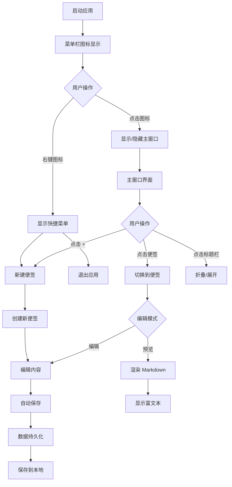
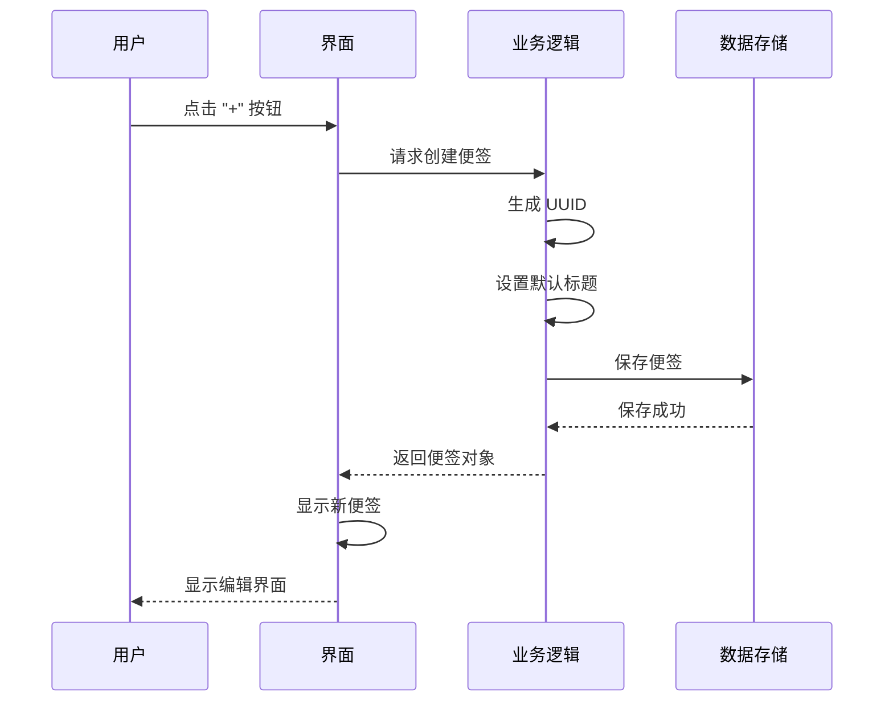

# PRD - QuickNote Clone 产品需求文档

## 1. 产品概述

### 1.1 产品定位
一款轻量级的 macOS 桌面便签应用,通过置顶悬浮窗口提供快速记录和管理便签的功能,支持 Markdown 语法,保持简洁高效的用户体验。

### 1.2 产品愿景
成为 macOS 用户最简单、最快速的桌面便签工具,让用户能够在任何工作场景下快速捕捉想法、管理任务。

### 1.3 核心价值主张
- **极速启动**: 菜单栏一键唤起,零延迟响应
- **简洁设计**: 无干扰界面,专注内容记录
- **Markdown 支持**: 格式化文本,提升阅读体验
- **置顶悬浮**: 始终可见,随时访问

---

## 2. 目标用户

### 2.1 用户画像

| 用户类型 | 描述 | 核心需求 |
|---------|------|---------|
| 程序员/开发者 | 需要快速记录代码片段、TODO 列表、会议笔记 | Markdown 支持、快速搜索 |
| 产品经理/设计师 | 需要记录灵感、待办事项、会议纪要 | 可视化管理、标签分类 |
| 学生/研究人员 | 需要整理学习笔记、文献摘要、复习要点 | 折叠展开、内容组织 |
| 自由职业者 | 需要管理多个项目任务、客户需求 | 多便签管理、快速切换 |

### 2.2 使用场景
- 快速记录会议要点
- 临时存储代码片段
- 管理每日待办事项
- 捕捉突然的灵感想法
- 整理项目笔记和文档

---

## 3. 核心功能列表

### 3.1 P0 功能（核心必需）

#### F1: 菜单栏集成
- **功能描述**: 应用图标驻留在 macOS 菜单栏,点击图标显示/隐藏主窗口
- **交互说明**:
  - 点击菜单栏图标 → 切换主窗口显示状态
  - 右键点击菜单栏图标 → 显示快捷菜单(新建便签、退出应用)
- **验收标准**:
  - 菜单栏图标始终可见
  - 点击响应时间 < 100ms
  - 支持深色/浅色模式自适应

#### F2: 便签创建与管理
- **功能描述**: 创建、编辑、删除便签,支持多便签同时存在
- **交互说明**:
  - 点击 "+" 按钮 → 创建新便签
  - 点击 "×" 按钮 → 删除便签(需确认)
  - 点击便签标题 → 切换到该便签
- **数据结构**:
  ```swift
  struct Note {
      id: UUID
      title: String
      content: String
      createdAt: Date
      updatedAt: Date
      isCollapsed: Bool
  }
  ```
- **验收标准**:
  - 支持至少 50 个便签
  - 创建/删除操作即时生效
  - 自动保存,无丢失风险

#### F3: 置顶悬浮窗口
- **功能描述**: 主窗口始终置顶显示,不被其他窗口遮挡
- **交互说明**:
  - 窗口默认置顶
  - 可通过快捷键切换置顶状态
  - 窗口可拖拽移动位置
- **技术实现**:
  - 使用 `NSWindow.level = .floating`
  - 监听 `NSWindow.didBecomeKey` 事件
- **验收标准**:
  - 窗口始终位于其他应用窗口之上
  - 拖拽流畅,无卡顿
  - 支持多显示器环境

#### F4: Markdown 编辑与渲染
- **功能描述**: 支持 Markdown 语法编辑和实时预览
- **支持的语法**:
  - 标题: `#` `##` `###`
  - 列表: `-` `*` `1.`
  - 强调: `**粗体**` `*斜体*`
  - 代码: ` `code` ` ```code block``` `
  - 链接: `[text](url)`
  - 分隔线: `---`
- **交互说明**:
  - 编辑模式: 显示原始 Markdown 文本
  - 预览模式: 显示渲染后的富文本
  - 双击便签 → 切换编辑/预览模式
- **技术实现**:
  - 使用 `Down` 或 `MarkdownUI` 库
  - 实时渲染,延迟 < 200ms
- **验收标准**:
  - 支持上述所有语法
  - 渲染准确,无格式错误
  - 编辑体验流畅,无卡顿

#### F5: 折叠/展开功能
- **功能描述**: 便签内容可折叠,仅显示标题,节省屏幕空间
- **交互说明**:
  - 点击便签标题栏 → 切换折叠/展开状态
  - 折叠状态: 仅显示标题和操作按钮
  - 展开状态: 显示完整内容
- **技术实现**:
  - 使用 `NSView.isHidden` 或 `NSLayoutConstraint`
  - 动画过渡,时长 200ms
- **验收标准**:
  - 折叠/展开动画流畅
  - 状态切换即时响应
  - 记忆每个便签的折叠状态

#### F6: 本地数据持久化
- **功能描述**: 便签数据自动保存到本地,应用重启后恢复
- **技术实现**:
  - 使用 `UserDefaults` 或 `CoreData`
  - 数据文件路径: `~/Library/Application Support/QuickNoteClone/`
  - 自动保存间隔: 30 秒或内容变更时
- **数据格式**:
  ```json
  {
    "notes": [
      {
        "id": "uuid",
        "title": "便签标题",
        "content": "Markdown 内容",
        "createdAt": "2026-01-05T10:00:00Z",
        "updatedAt": "2026-01-05T10:30:00Z",
        "isCollapsed": false
      }
    ],
    "appSettings": {
      "windowPosition": {"x": 100, "y": 100},
      "windowSize": {"width": 400, "height": 600}
    }
  }
  ```
- **验收标准**:
  - 数据保存成功率 100%
  - 应用重启后数据完整恢复
  - 支持数据导出/导入

### 3.2 P1 功能（重要优化）

#### F7: 快捷键支持
- **功能描述**: 提供快捷键快速执行常用操作
- **快捷键列表**:
  - `⌘ + N`: 新建便签
  - `⌘ + W`: 关闭当前便签
  - `⌘ + ,`: 打开设置
  - `⌘ + /`: 切换编辑/预览模式
  - `⌘ + ⇧ + F`: 切换置顶状态
  - `⌘ + ⇧ + D`: 切换深色/浅色模式
- **验收标准**:
  - 所有快捷键正常工作
  - 无冲突(与系统快捷键)
  - 可自定义快捷键

#### F8: 深色模式支持
- **功能描述**: 自动适配 macOS 系统深色/浅色模式
- **技术实现**:
  - 监听 `NSColorSpaceName` 变化
  - 使用系统动态颜色: `NSColor.labelColor`
  - 自定义主题色: 黄色(经典便签色)
- **验收标准**:
  - 自动适配系统主题
  - 颜色对比度符合 WCAG AA 标准
  - 切换流畅,无闪烁

#### F9: 便签搜索
- **功能描述**: 快速搜索便签标题和内容
- **交互说明**:
  - 在搜索框输入关键词 → 实时过滤便签列表
  - 支持模糊匹配
  - 高亮匹配文本
- **技术实现**:
  - 使用 `NSPredicate` 进行过滤
  - 搜索延迟: 300ms 防抖
- **验收标准**:
  - 搜索响应时间 < 200ms
  - 支持中文搜索
  - 准确率 > 95%

#### F10: 窗口大小记忆
- **功能描述**: 记住用户调整的窗口大小和位置
- **技术实现**:
  - 监听 `NSWindow.didResize` 和 `NSWindow.didMove`
  - 保存到 `UserDefaults`
  - 应用启动时恢复
- **验收标准**:
  - 窗口位置/大小准确恢复
  - 支持多显示器环境
  - 边界检测,防止窗口超出屏幕

### 3.3 P2 功能（未来扩展）

#### F11: 标签分类
- **功能描述**: 为便签添加标签,支持按标签筛选
- **交互说明**:
  - 便签底部显示标签输入框
  - 输入标签名,按 Enter 添加
  - 点击标签 → 筛选该标签的便签
- **验收标准**:
  - 支持多标签
  - 标签颜色可自定义
  - 标签筛选准确

#### F12: 导出功能
- **功能描述**: 将便签导出为 Markdown、TXT、PDF 格式
- **交互说明**:
  - 右键便签 → 选择"导出"
  - 选择导出格式和保存位置
- **验收标准**:
  - 支持三种格式
  - 导出内容完整,无格式丢失
  - 支持批量导出

#### F13: 云同步
- **功能描述**: 通过 iCloud 同步便签到其他设备
- **技术实现**:
  - 使用 `NSUbiquitousKeyValueStore`
  - 或集成 CloudKit
- **验收标准**:
  - 同步延迟 < 5 秒
  - 支持冲突解决
  - 离线可用,上线后自动同步

---

## 4. 用户流程图

### 4.1 核心用户流程



### 4.2 便签创建流程



---

## 5. 交互设计说明

### 5.1 主界面布局

```
┌─────────────────────────────────┐
│ ☰ QuickNote Clone        ⚙️ ✕ │ ← 菜单栏图标
└─────────────────────────────────┘
           ↓ 点击图标
┌─────────────────────────────────┐
│  🔍 搜索便签...               │ ← 搜索栏
├─────────────────────────────────┤
│  + 新建便签                    │ ← 操作按钮
├─────────────────────────────────┤
│  📝 便签 1          [折叠]    │ ← 便签列表
│  ┌───────────────────────────┐ │
│  │ # 标题                    │ │
│  │ - 内容项 1                │ │
│  │ - 内容项 2                │ │
│  └───────────────────────────┘ │
├─────────────────────────────────┤
│  📝 便签 2          [展开]    │
│  ┌───────────────────────────┐ │
│  │ **粗体** *斜体*           │ │
│  └───────────────────────────┘ │
└─────────────────────────────────┘
```

### 5.2 交互细节

#### 5.2.1 便签编辑
- **编辑模式**:
  - 光标自动定位到内容区域
  - 支持 Tab 键缩进
  - 支持 ⌘+B / ⌘+I 快捷格式化
- **预览模式**:
  - 只读模式,不可编辑
  - 点击内容区域切换到编辑模式
  - 长链接自动截断,鼠标悬停显示完整链接

#### 5.2.2 窗口操作
- **拖拽移动**:
  - 拖拽标题栏移动窗口
  - 鼠标释放时吸附到屏幕边缘(可选)
- **调整大小**:
  - 支持拖拽右下角调整窗口大小
  - 最小尺寸: 300×400
  - 最大尺寸: 800×1200

#### 5.2.3 动画效果
- **展开/折叠**:
  - 使用 `NSAnimationContext`
  - 时长: 200ms
  - 缓动函数: ease-in-out
- **便签切换**:
  - 淡入淡出效果
  - 时长: 150ms
- **菜单栏图标**:
  - 点击时轻微缩放动画
  - 时长: 100ms

### 5.3 反馈机制

#### 5.3.1 视觉反馈
- **操作成功**:
  - 绿色边框闪烁 200ms
  - Toast 提示"已保存"
- **操作失败**:
  - 红色边框闪烁 200ms
  - Toast 提示错误信息
- **加载状态**:
  - 显示加载指示器
  - 操作按钮禁用

#### 5.3.2 音效反馈（可选）
- **创建便签**: 清脆的"叮"声
- **删除便签**: 撕纸声
- **保存成功**: 轻微的"嗒"声

---

## 6. 功能优先级

| 优先级 | 功能模块 | 功能点 | 影响面 | 落地成本 |
|-------|---------|--------|--------|---------|
| **P0** | 菜单栏集成 | 图标显示/隐藏 | 高 | 低 |
| **P0** | 便签管理 | 创建/编辑/删除 | 高 | 低 |
| **P0** | 窗口管理 | 置顶/拖拽 | 高 | 中 |
| **P0** | 内容编辑 | Markdown 支持 | 高 | 高 |
| **P0** | 交互优化 | 折叠/展开 | 中 | 低 |
| **P0** | 数据存储 | 本地持久化 | 高 | 中 |
| **P1** | 快捷键 | 常用操作 | 中 | 低 |
| **P1** | 主题适配 | 深色模式 | 中 | 中 |
| **P1** | 搜索功能 | 便签搜索 | 中 | 中 |
| **P1** | 窗口记忆 | 位置/大小 | 低 | 低 |
| **P2** | 标签分类 | 多标签管理 | 中 | 高 |
| **P2** | 导出功能 | 多格式导出 | 低 | 中 |
| **P2** | 云同步 | iCloud 同步 | 高 | 高 |

---

## 7. 非功能性需求

### 7.1 性能要求
- 应用启动时间 < 3 秒
- 窗口显示/隐藏延迟 < 100ms
- Markdown 渲染延迟 < 200ms
- 搜索响应时间 < 200ms
- 内存占用 < 50MB
- CPU 占用 < 5%(空闲时)

### 7.2 兼容性要求
- macOS 版本: 14.0 及以上
- 架构: Intel + Apple Silicon(通用二进制)
- 屏幕分辨率: 1280×720 及以上

### 7.3 安全性要求
- 数据加密存储(可选)
- 无网络请求(除非云同步)
- 隐私数据不上传
- 代码签名,防止篡改

### 7.4 可用性要求
- 界面简洁,学习成本 < 5 分钟
- 操作流程直观,无需说明书
- 错误提示清晰,可理解
- 支持键盘操作,减少鼠标依赖

---

## 8. 成功指标

### 8.1 产品指标
- 用户留存率: 7 日留存 > 30%, 30 日留存 > 15%
- 用户活跃度: 日活用户平均使用时长 > 5 分钟
- 功能使用率: Markdown 编辑使用率 > 60%

### 8.2 技术指标
- 崩溃率 < 0.1%
- 应用评分 > 4.0/5.0
- 加载时间 < 3 秒
- 内存占用 < 50MB

### 8.3 用户满意度
- 问卷评分 > 4.0/5.0
- 正面评价占比 > 70%
- 功能建议采纳率 > 30%

---

**文档版本**: v1.0
**创建日期**: 2026-01-05
**最后更新**: 2026-01-05
**文档状态**: 待评审