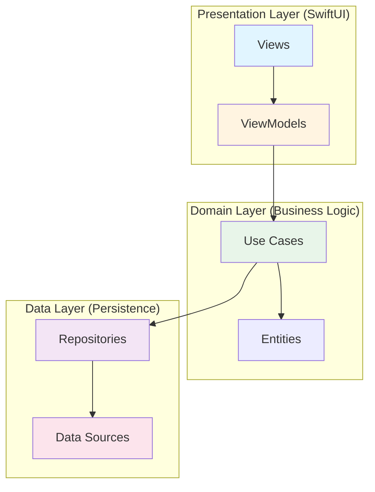
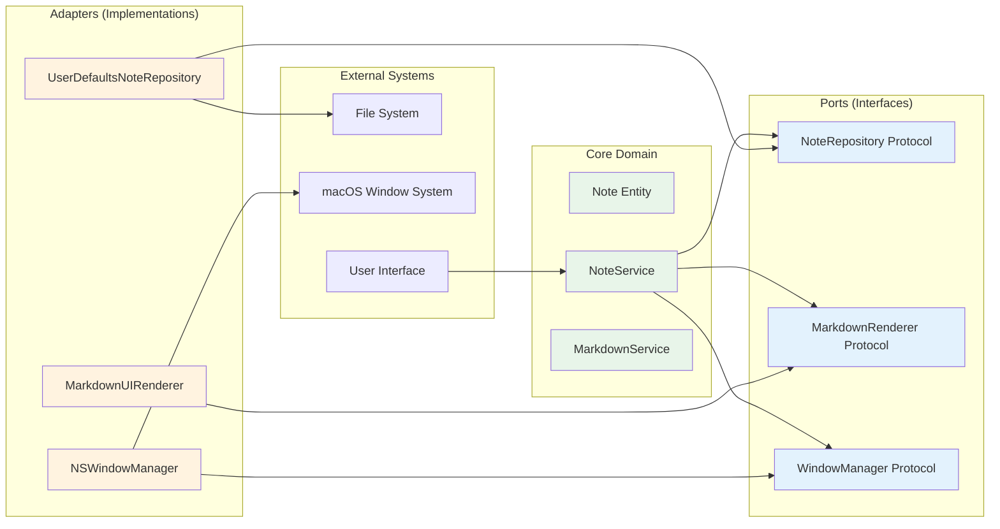
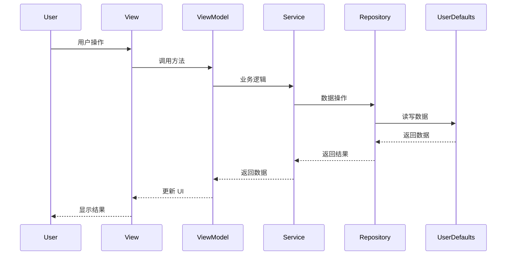

# 技术开发文档 - QuickNote Clone

## 1. 技术架构设计

### 1.1 技术栈选型

| 层次 | 技术选型 | 版本 | 选型理由 |
|-----|---------|------|---------|
| **开发语言** | Swift | 5.9+ | 原生性能,强类型,Apple 生态最佳实践 |
| **UI 框架** | SwiftUI | macOS 14+ | 声明式 UI,现代化开发,代码简洁 |
| **数据存储** | UserDefaults + JSON | - | 轻量级,无需复杂依赖,满足需求 |
| **Markdown 渲染** | MarkdownUI | 2.0+ | SwiftUI 原生支持,功能完善,性能优秀 |
| **架构模式** | MVVM + Clean Architecture | - | 职责分离,可测试性高,符合 SOLID |
| **依赖管理** | Swift Package Manager | - | Apple 官方,集成简单,无需额外工具 |
| **构建工具** | Xcode | 15.0+ | 官方 IDE,调试便利,性能分析完善 |

### 1.2 架构设计原则

遵循 **SOLID** 原则和 **Clean Architecture**:



#### 1.2.1 依赖倒置原则(DIP)
- 高层模块(Domain Layer)不依赖低层模块(Data Layer)
- 两者都依赖抽象(Protocols)
- 使用依赖注入(DI)解耦

#### 1.2.2 单一职责原则(SRP)
- 每个 Class/Struct 仅负责一个功能
- View 只负责 UI 渲染
- ViewModel 只负责业务逻辑
- Repository 只负责数据访问

#### 1.2.3 开闭原则(OCP)
- 对扩展开放,对修改关闭
- 使用 Protocol 定义接口
- 新功能通过扩展实现

### 1.3 六边形架构图



---

## 2. 核心模块划分

### 2.1 模块结构

```
QuickNoteClone/
├── QuickNoteCloneApp.swift          # 应用入口
├── Models/                          # 数据模型层
│   ├── Note.swift                   # 便签实体
│   ├── AppSettings.swift            # 应用设置
│   └── NoteColor.swift              # 便签颜色枚举
├── ViewModels/                      # 视图模型层
│   ├── NoteListViewModel.swift      # 便签列表 VM
│   ├── NoteDetailViewModel.swift    # 便签详情 VM
│   └── AppViewModel.swift           # 应用 VM
├── Views/                           # 视图层
│   ├── MenuBarView.swift            # 菜单栏视图
│   ├── MainWindow.swift             # 主窗口
│   ├── NoteListView.swift           # 便签列表视图
│   ├── NoteDetailView.swift         # 便签详情视图
│   └── Components/                  # 可复用组件
│       ├── SearchBar.swift          # 搜索栏
│       ├── NoteCard.swift           # 便签卡片
│       └── MarkdownEditor.swift     # Markdown 编辑器
├── Services/                        # 服务层
│   ├── NoteService.swift            # 便签业务逻辑
│   ├── MarkdownService.swift        # Markdown 渲染服务
│   └── WindowService.swift          # 窗口管理服务
├── Repositories/                    # 数据仓库层
│   ├── NoteRepository.swift         # 便签仓库接口
│   └── UserDefaultsNoteRepository.swift  # UserDefaults 实现
├── Utils/                           # 工具类
│   ├── DateExtensions.swift         # 日期扩展
│   ├── StringExtensions.swift       # 字符串扩展
│   └── Constants.swift              # 常量定义
└── Resources/                       # 资源文件
    ├── Assets.xcassets              # 图片资源
    └── Colors.xcassets              # 颜色资源
```

### 2.2 模块职责

#### 2.2.1 Models 层
**职责**: 定义数据结构和业务实体

```swift
// Models/Note.swift
import Foundation

struct Note: Identifiable, Codable, Equatable {
    let id: UUID
    var title: String
    var content: String
    var createdAt: Date
    var updatedAt: Date
    var isCollapsed: Bool

    init(
        id: UUID = UUID(),
        title: String = "新便签",
        content: String = "",
        createdAt: Date = Date(),
        updatedAt: Date = Date(),
        isCollapsed: Bool = false
    ) {
        self.id = id
        self.title = title
        self.content = content
        self.createdAt = createdAt
        self.updatedAt = updatedAt
        self.isCollapsed = isCollapsed
    }
}
```

#### 2.2.2 ViewModels 层
**职责**: 处理业务逻辑,连接 View 和 Model

```swift
// ViewModels/NoteListViewModel.swift
import SwiftUI
import Combine

@MainActor
class NoteListViewModel: ObservableObject {
    @Published var notes: [Note] = []
    @Published var searchText: String = ""
    @Published var isLoading: Bool = false

    private let noteService: NoteService
    private var cancellables = Set<AnyCancellable>()

    init(noteService: NoteService = .shared) {
        self.noteService = noteService
        loadNotes()
        setupSearch()
    }

    func loadNotes() {
        isLoading = true
        Task {
            notes = await noteService.getAllNotes()
            isLoading = false
        }
    }

    func createNote() {
        let newNote = Note()
        Task {
            await noteService.createNote(newNote)
            await MainActor.run {
                notes.insert(newNote, at: 0)
            }
        }
    }

    func deleteNote(_ note: Note) {
        Task {
            await noteService.deleteNote(note.id)
            await MainActor.run {
                notes.removeAll { $0.id == note.id }
            }
        }
    }

    func toggleCollapse(_ note: Note) {
        if let index = notes.firstIndex(where: { $0.id == note.id }) {
            notes[index].isCollapsed.toggle()
            Task {
                await noteService.updateNote(notes[index])
            }
        }
    }

    private func setupSearch() {
        $searchText
            .debounce(for: .milliseconds(300), scheduler: RunLoop.main)
            .sink { [weak self] _ in
                self?.performSearch()
            }
            .store(in: &cancellables)
    }

    private func performSearch() {
        if searchText.isEmpty {
            loadNotes()
        } else {
            notes = notes.filter { note in
                note.title.localizedCaseInsensitiveContains(searchText) ||
                note.content.localizedCaseInsensitiveContains(searchText)
            }
        }
    }
}
```

#### 2.2.3 Views 层
**职责**: UI 渲染和用户交互

```swift
// Views/NoteListView.swift
import SwiftUI

struct NoteListView: View {
    @StateObject private var viewModel = NoteListViewModel()

    var body: some View {
        VStack(spacing: 0) {
            // 搜索栏
            SearchBar(text: $viewModel.searchText)

            // 操作按钮
            HStack {
                Button(action: viewModel.createNote) {
                    Label("新建便签", systemImage: "plus")
                }
                .buttonStyle(.borderedProminent)

                Spacer()
            }
            .padding()

            // 便签列表
            if viewModel.isLoading {
                ProgressView("加载中...")
                    .frame(maxWidth: .infinity, maxHeight: .infinity)
            } else if viewModel.notes.isEmpty {
                emptyStateView
            } else {
                ScrollView {
                    LazyVStack(spacing: 12) {
                        ForEach(viewModel.notes) { note in
                            NoteCard(
                                note: note,
                                onDelete: { viewModel.deleteNote(note) },
                                onToggleCollapse: { viewModel.toggleCollapse(note) }
                            )
                        }
                    }
                    .padding()
                }
            }
        }
        .frame(minWidth: 400, minHeight: 600)
    }

    private var emptyStateView: some View {
        VStack(spacing: 16) {
            Image(systemName: "note.text")
                .font(.system(size: 64))
                .foregroundColor(.secondary)
            Text("还没有便签")
                .font(.title2)
                .foregroundColor(.secondary)
            Text("点击上方按钮创建第一个便签")
                .foregroundColor(.secondary)
        }
        .frame(maxWidth: .infinity, maxHeight: .infinity)
    }
}
```

#### 2.2.4 Services 层
**职责**: 业务逻辑处理

```swift
// Services/NoteService.swift
import Foundation

actor NoteService {
    static let shared = NoteService()

    private let repository: NoteRepository

    init(repository: NoteRepository = UserDefaultsNoteRepository()) {
        self.repository = repository
    }

    func getAllNotes() async -> [Note] {
        return await repository.fetchAll()
    }

    func getNote(by id: UUID) async -> Note? {
        return await repository.fetch(by: id)
    }

    func createNote(_ note: Note) async {
        var newNote = note
        newNote.createdAt = Date()
        newNote.updatedAt = Date()
        await repository.save(newNote)
    }

    func updateNote(_ note: Note) async {
        var updatedNote = note
        updatedNote.updatedAt = Date()
        await repository.save(updatedNote)
    }

    func deleteNote(_ id: UUID) async {
        await repository.delete(id)
    }

    func searchNotes(query: String) async -> [Note] {
        let notes = await repository.fetchAll()
        return notes.filter { note in
            note.title.localizedCaseInsensitiveContains(query) ||
            note.content.localizedCaseInsensitiveContains(query)
        }
    }
}
```

#### 2.2.5 Repositories 层
**职责**: 数据持久化

```swift
// Repositories/NoteRepository.swift
import Foundation

protocol NoteRepository {
    func fetchAll() async -> [Note]
    func fetch(by id: UUID) async -> Note?
    func save(_ note: Note) async
    func delete(_ id: UUID) async
}

// Repositories/UserDefaultsNoteRepository.swift
import Foundation

actor UserDefaultsNoteRepository: NoteRepository {
    private enum Keys {
        static let notes = "notes"
    }

    private let userDefaults: UserDefaults

    init(userDefaults: UserDefaults = .standard) {
        self.userDefaults = userDefaults
    }

    func fetchAll() async -> [Note] {
        guard let data = userDefaults.data(forKey: Keys.notes),
              let notes = try? JSONDecoder().decode([Note].self, from: data) else {
            return []
        }
        return notes.sorted { $0.updatedAt > $1.updatedAt }
    }

    func fetch(by id: UUID) async -> Note? {
        let notes = await fetchAll()
        return notes.first { $0.id == id }
    }

    func save(_ note: Note) async {
        var notes = await fetchAll()
        if let index = notes.firstIndex(where: { $0.id == note.id }) {
            notes[index] = note
        } else {
            notes.append(note)
        }
        await saveNotes(notes)
    }

    func delete(_ id: UUID) async {
        var notes = await fetchAll()
        notes.removeAll { $0.id == id }
        await saveNotes(notes)
    }

    private func saveNotes(_ notes: [Note]) async {
        if let data = try? JSONEncoder().encode(notes) {
            userDefaults.set(data, forKey: Keys.notes)
        }
    }
}
```

---

## 3. 数据结构设计

### 3.1 核心数据模型

```swift
// 便签实体
struct Note: Identifiable, Codable {
    let id: UUID                      // 唯一标识
    var title: String                 // 标题(最大 100 字符)
    var content: String               // Markdown 内容
    var createdAt: Date               // 创建时间
    var updatedAt: Date               // 更新时间
    var isCollapsed: Bool             // 折叠状态
    var color: NoteColor?             // 便签颜色(可选)
}

// 便签颜色枚举
enum NoteColor: String, CaseIterable, Codable {
    case yellow = "yellow"           // 经典黄色
    case blue = "blue"               // 蓝色
    case green = "green"             // 绿色
    case pink = "pink"               // 粉色
    case purple = "purple"           // 紫色

    var color: Color {
        switch self {
        case .yellow: return Color.yellow.opacity(0.3)
        case .blue: return Color.blue.opacity(0.3)
        case .green: return Color.green.opacity(0.3)
        case .pink: return Color.pink.opacity(0.3)
        case .purple: return Color.purple.opacity(0.3)
        }
    }
}

// 应用设置
struct AppSettings: Codable {
    var windowPosition: CGPoint       // 窗口位置
    var windowSize: CGSize           // 窗口大小
    var isDarkMode: Bool             // 深色模式
    var isAlwaysOnTop: Bool          // 置顶状态
    var fontSize: Double             // 字体大小
    var autoSaveInterval: TimeInterval  // 自动保存间隔
}
```

### 3.2 数据存储格式

```json
{
  "notes": [
    {
      "id": "550E8400-E29B-41D4-A716-446655440000",
      "title": "会议笔记",
      "content": "# 项目进度\n\n- [x] 完成需求分析\n- [ ] 开始开发\n\n**备注**: 下周一评审",
      "createdAt": "2026-01-05T10:00:00Z",
      "updatedAt": "2026-01-05T14:30:00Z",
      "isCollapsed": false,
      "color": "yellow"
    }
  ],
  "appSettings": {
    "windowPosition": {"x": 100, "y": 100},
    "windowSize": {"width": 400, "height": 600},
    "isDarkMode": false,
    "isAlwaysOnTop": true,
    "fontSize": 14,
    "autoSaveInterval": 30
  }
}
```

### 3.3 数据流图



---

## 4. 关键技术点

### 4.1 置顶窗口实现

#### 4.1.1 技术方案
使用 `NSWindow` 的 `level` 属性实现窗口置顶。

#### 4.1.2 代码实现

```swift
import AppKit
import SwiftUI

class FloatingWindow: NSWindow {
    init(contentRect: NSRect, styleMask style: NSWindow.StyleMask, backing backingStoreType: NSWindow.BackingStoreType, defer flag: Bool) {
        super.init(contentRect: contentRect, styleMask: style, backing: backingStoreType, defer: flag)

        // 设置窗口级别为置顶
        self.level = .floating

        // 窗口不可调整大小(可选)
        self.styleMask = [.titled, .closable, .miniaturizable, .resizable]

        // 窗口背景透明
        self.isOpaque = false
        self.backgroundColor = .clear

        // 窗口阴影
        self.hasShadow = true
    }

    // 防止窗口被 Dock 遮挡
    override var canBecomeKey: Bool {
        return true
    }

    // 防止窗口被其他应用激活时隐藏
    override var canBecomeMain: Bool {
        return true
    }
}

// SwiftUI 包装器
struct FloatingWindowView: View {
    @State private var isAlwaysOnTop = true

    var body: some View {
        VStack {
            // 主内容
            NoteListView()
        }
        .frame(minWidth: 400, minHeight: 600)
        .background(
            HostingWindowFinder { window in
                window?.level = isAlwaysOnTop ? .floating : .normal
            }
        )
    }
}

// 辅助类: 获取 NSWindow
struct HostingWindowFinder: NSViewRepresentable {
    var callback: (NSWindow?) -> Void

    func makeNSView(context: Context) -> NSView {
        let view = NSView()
        DispatchQueue.main.async { [weak view] in
            callback(view?.window)
        }
        return view
    }

    func updateNSView(_ nsView: NSView, context: Context) {}
}
```

#### 4.1.3 窗口级别说明

| 级别 | 枚举值 | 说明 |
|-----|-------|------|
| Normal | `.normal` | 普通窗口 |
| Floating | `.floating` | 置顶窗口(推荐) |
| ModalPanel | `.modalPanel` | 模态面板 |
| PopUpMenu | `.popUpMenu` | 弹出菜单 |
| ScreenSaver | `.screenSaver` | 屏幕保护程序 |

### 4.2 Markdown 渲染实现

#### 4.2.1 技术方案
使用 `MarkdownUI` 库实现 Markdown 渲染。

#### 4.2.2 依赖配置

```swift
// Package.swift
// swift-tools-version: 5.9
import PackageDescription

let package = Package(
    name: "QuickNoteClone",
    platforms: [
        .macOS(.v14)
    ],
    dependencies: [
        .package(url: "https://github.com/gonzalezreal/swift-markdown-ui", from: "2.0.0")
    ],
    targets: [
        .executableTarget(
            name: "QuickNoteClone",
            dependencies: [
                .product(name: "MarkdownUI", package: "swift-markdown-ui")
            ]
        )
    ]
)
```

#### 4.2.3 代码实现

```swift
import SwiftUI
import MarkdownUI

struct MarkdownEditor: View {
    @Binding var content: String
    @State private var isEditing = true

    var body: some View {
        VStack(spacing: 0) {
            // 工具栏
            toolbar

            // 编辑器/预览
            if isEditing {
                TextEditor(text: $content)
                    .font(.system(size: 14, family: .monospaced))
                    .padding()
            } else {
                ScrollView {
                    Markdown(content)
                        .markdownTheme(.gitHub)
                        .padding()
                }
            }
        }
        .onTapGesture(count: 2) {
            withAnimation {
                isEditing.toggle()
            }
        }
    }

    private var toolbar: some View {
        HStack {
            Button(action: { isEditing = true }) {
                Image(systemName: "pencil")
                    .foregroundColor(isEditing ? .accentColor : .secondary)
            }

            Button(action: { isEditing = false }) {
                Image(systemName: "doc.text")
                    .foregroundColor(!isEditing ? .accentColor : .secondary)
            }

            Spacer()

            Text(isEditing ? "编辑模式" : "预览模式")
                .font(.caption)
                .foregroundColor(.secondary)
        }
        .padding(.horizontal)
        .padding(.vertical, 8)
        .background(Color(nsColor: .controlBackgroundColor))
    }
}

// 自定义 Markdown 主题
extension Theme {
    static let customGitHub = Theme.gitHub
        .text {
            FontSize(14)
            FontFamily(.system(.body))
            ForegroundColor(.primary)
        }
        .heading1 { configuration in
            VStack(alignment: .leading, spacing: 0) {
                configuration.label
                    .relativePadding(.bottom, length: .em(0.3))
                Divider()
            }
            .markdownMargin(top: .em(1.5), bottom: .em(1))
        }
        .codeBlock { configuration in
            ScrollView(.horizontal) {
                configuration.label
                    .relativePadding(.horizontal, length: .em(0.5))
                    .font(.system(size: 13, family: .monospaced))
                    .foregroundColor(Color(nsColor: .labelColor))
            }
            .background(Color(nsColor: .textBackgroundColor))
            .clipShape(RoundedRectangle(cornerRadius: 4))
            .markdownMargin(top: .em(0.8), bottom: .em(0.8))
        }
}
```

### 4.3 状态管理实现

#### 4.3.1 技术方案
使用 `@Published` + `Combine` 实现响应式状态管理。

#### 4.3.2 代码实现

```swift
import SwiftUI
import Combine

// 全局应用状态
@MainActor
class AppState: ObservableObject {
    static let shared = AppState()

    @Published var isDarkMode: Bool = false
    @Published var isAlwaysOnTop: Bool = true
    @Published var fontSize: Double = 14
    @Published var windowPosition: CGPoint = .zero
    @Published var windowSize: CGSize = .zero

    private let userDefaults: UserDefaults
    private var cancellables = Set<AnyCancellable>()

    init(userDefaults: UserDefaults = .standard) {
        self.userDefaults = userDefaults
        loadSettings()
        setupBindings()
    }

    private func setupBindings() {
        // 监听状态变化,自动保存
        $isDarkMode
            .debounce(for: .seconds(1), scheduler: RunLoop.main)
            .sink { [weak self] _ in self?.saveSettings() }
            .store(in: &cancellables)

        $isAlwaysOnTop
            .debounce(for: .seconds(1), scheduler: RunLoop.main)
            .sink { [weak self] _ in self?.saveSettings() }
            .store(in: &cancellables)
    }

    private func loadSettings() {
        isDarkMode = userDefaults.bool(forKey: "isDarkMode")
        isAlwaysOnTop = userDefaults.bool(forKey: "isAlwaysOnTop")
        fontSize = userDefaults.double(forKey: "fontSize")

        if let positionData = userDefaults.data(forKey: "windowPosition"),
           let position = try? JSONDecoder().decode(CGPoint.self, from: positionData) {
            windowPosition = position
        }

        if let sizeData = userDefaults.data(forKey: "windowSize"),
           let size = try? JSONDecoder().decode(CGSize.self, from: sizeData) {
            windowSize = size
        }
    }

    private func saveSettings() {
        userDefaults.set(isDarkMode, forKey: "isDarkMode")
        userDefaults.set(isAlwaysOnTop, forKey: "isAlwaysOnTop")
        userDefaults.set(fontSize, forKey: "fontSize")

        if let positionData = try? JSONEncoder().encode(windowPosition) {
            userDefaults.set(positionData, forKey: "windowPosition")
        }

        if let sizeData = try? JSONEncoder().encode(windowSize) {
            userDefaults.set(sizeData, forKey: "windowSize")
        }
    }
}

// 在 View 中使用
struct ContentView: View {
    @StateObject private var appState = AppState.shared

    var body: some View {
        VStack {
            Toggle("置顶窗口", isOn: $appState.isAlwaysOnTop)
            Toggle("深色模式", isOn: $appState.isDarkMode)
        }
        .preferredColorScheme(appState.isDarkMode ? .dark : .light)
    }
}
```

### 4.4 菜单栏集成实现

#### 4.4.1 技术方案
使用 `NSStatusBar` + `NSPopUpButton` 实现菜单栏图标。

#### 4.4.2 代码实现

```swift
import AppKit
import SwiftUI

class MenuBarManager: ObservableObject {
    static let shared = MenuBarManager()

    private var statusItem: NSStatusItem?
    private var popover: NSPopover?
    private var mainWindow: NSWindow?

    init() {
        setupMenuBar()
    }

    private func setupMenuBar() {
        // 创建菜单栏图标
        statusItem = NSStatusBar.system.statusItem(withLength: NSStatusItem.squareLength)

        if let button = statusItem?.button {
            button.image = NSImage(systemSymbolName: "note.text", accessibilityDescription: "QuickNote")
            button.action = #selector(togglePopover)
            button.target = self
        }

        // 创建 Popover
        popover = NSPopover()
        popover?.contentSize = NSSize(width: 400, height: 600)
        popover?.behavior = .transient
        popover?.contentViewController = NSHostingController(rootView: NoteListView())
    }

    @objc private func togglePopover() {
        if let popover = popover {
            if popover.isShown {
                closePopover()
            } else {
                showPopover()
            }
        }
    }

    private func showPopover() {
        guard let button = statusItem?.button else { return }

        popover?.show(relativeTo: button.bounds, of: button, preferredEdge: .minY)

        // 设置窗口置顶
        if let window = popover?.contentViewController?.view.window {
            window.level = .floating
        }
    }

    private func closePopover() {
        popover?.performClose(nil)
    }

    func setMainWindow(_ window: NSWindow) {
        self.mainWindow = window
    }
}

// 应用入口
@main
struct QuickNoteCloneApp: App {
    @NSApplicationDelegateAdaptor(AppDelegate.self) var appDelegate

    var body: some Scene {
        Settings {
            EmptyView()
        }
    }
}

class AppDelegate: NSObject, NSApplicationDelegate {
    func applicationDidFinishLaunching(_ notification: Notification) {
        // 初始化菜单栏
        _ = MenuBarManager.shared

        // 隐藏 Dock 图标
        NSApp.setActivationPolicy(.accessory)
    }

    func applicationShouldTerminateAfterLastWindowClosed(_ sender: NSApplication) -> Bool {
        return false // 不退出应用
    }
}
```

---

## 5. 开发规范和最佳实践

### 5.1 命名规范

#### 5.1.1 命名约定
- **类名**: 大驼峰(PascalCase),如 `NoteService`
- **方法名**: 小驼峰(camelCase),如 `createNote()`
- **变量名**: 小驼峰(camelCase),如 `noteTitle`
- **常量**: 小驼峰或全大写加下划线,如 `maxTitleLength` 或 `MAX_TITLE_LENGTH`
- **协议名**: 大驼峰,以 `Protocol` 结尾(可选),如 `NoteRepository`
- **枚举值**: 小驼峰,如 `case yellow`

#### 5.1.2 命名原则
- **语义化**: 名称应清晰表达意图
- **简洁性**: 避免冗余,如 `NoteViewModel` 而非 `NoteViewModelClass`
- **一致性**: 同类事物使用相同命名模式
- **避免缩写**: 除非广泛认可(如 `URL`, `ID`)

### 5.2 代码组织规范

#### 5.2.1 文件组织
- 单文件单类/结构体
- 文件名与类名一致
- 使用 `// MARK:` 分组代码

```swift
// NoteService.swift
import Foundation

// MARK: - NoteService

actor NoteService {
    // MARK: - Properties

    static let shared = NoteService()
    private let repository: NoteRepository

    // MARK: - Initialization

    init(repository: NoteRepository = UserDefaultsNoteRepository()) {
        self.repository = repository
    }

    // MARK: - Public Methods

    func getAllNotes() async -> [Note] {
        // ...
    }

    // MARK: - Private Methods

    private func validateNote(_ note: Note) throws {
        // ...
    }
}
```

#### 5.2.2 导入顺序
1. 系统框架
2. 第三方库
3. 项目模块

```swift
import Foundation
import AppKit
import SwiftUI

import MarkdownUI
import Combine

import Models
import Services
```

### 5.3 注释规范

#### 5.3.1 文档注释
公共 API 必须包含文档注释:

```swift
/// 便签服务,负责便签的业务逻辑处理
///
/// 使用示例:
/// ```swift
/// let service = NoteService.shared
/// let notes = await service.getAllNotes()
/// ```
actor NoteService {
    /// 获取所有便签
    ///
    /// - Returns: 按更新时间降序排列的便签列表
    /// - Throws: 数据读取失败时抛出错误
    func getAllNotes() async throws -> [Note] {
        // ...
    }
}
```

#### 5.3.2 行内注释
解释"为什么"而非"做什么":

```swift
// 使用 debounce 防止频繁保存
$searchText
    .debounce(for: .milliseconds(300), scheduler: RunLoop.main)
    .sink { [weak self] _ in self?.performSearch() }
    .store(in: &cancellables)

// 不推荐: 以下代码设置 debounce 为 300ms
```

### 5.4 错误处理规范

#### 5.4.1 自定义错误

```swift
enum NoteError: LocalizedError {
    case invalidTitle
    case contentTooLong
    case saveFailed
    case notFound

    var errorDescription: String? {
        switch self {
        case .invalidTitle:
            return "便签标题不能为空"
        case .contentTooLong:
            return "便签内容过长"
        case .saveFailed:
            return "保存失败"
        case .notFound:
            return "便签不存在"
        }
    }
}
```

#### 5.4.2 错误处理

```swift
func createNote(_ note: Note) async throws {
    // 验证
    guard !note.title.isEmpty else {
        throw NoteError.invalidTitle
    }

    guard note.content.count <= 10000 else {
        throw NoteError.contentTooLong
    }

    // 保存
    do {
        try await repository.save(note)
    } catch {
        throw NoteError.saveFailed
    }
}

// 调用时处理
Task {
    do {
        try await noteService.createNote(note)
    } catch NoteError.invalidTitle {
        showAlert("标题不能为空")
    } catch {
        showAlert("创建失败: \(error.localizedDescription)")
    }
}
```

### 5.5 性能优化规范

#### 5.5.1 异步操作
- 使用 `async/await` 替代回调
- 避免在主线程执行耗时操作

```swift
// 推荐
func loadNotes() async {
    notes = await noteService.getAllNotes()
}

// 不推荐
func loadNotes() {
    DispatchQueue.global().async {
        let notes = noteService.getAllNotes()
        DispatchQueue.main.async {
            self.notes = notes
        }
    }
}
```

#### 5.5.2 内存优化
- 使用 `weak self` 避免循环引用
- 及时释放不需要的资源

```swift
$searchText
    .debounce(for: .milliseconds(300), scheduler: RunLoop.main)
    .sink { [weak self] _ in
        self?.performSearch()
    }
    .store(in: &cancellables)
```

#### 5.5.3 UI 优化
- 使用 `LazyVStack` 懒加载列表
- 避免不必要的视图刷新

```swift
ScrollView {
    LazyVStack(spacing: 12) {
        ForEach(notes) { note in
            NoteCard(note: note)
        }
    }
}
```

### 5.6 测试规范

#### 5.6.1 单元测试
- 使用 `XCTest` 框架
- 测试覆盖率 ≥ 90%

```swift
import XCTest
@testable import QuickNoteClone

final class NoteServiceTests: XCTestCase {
    var service: NoteService!
    var mockRepository: MockNoteRepository!

    override func setUp() {
        super.setUp()
        mockRepository = MockNoteRepository()
        service = NoteService(repository: mockRepository)
    }

    override func tearDown() {
        service = nil
        mockRepository = nil
        super.tearDown()
    }

    func testCreateNote() async throws {
        // Given
        let note = Note(title: "测试", content: "内容")

        // When
        try await service.createNote(note)

        // Then
        let savedNote = try await service.getNote(by: note.id)
        XCTAssertEqual(savedNote?.title, "测试")
    }

    func testCreateNoteWithEmptyTitle() async {
        // Given
        let note = Note(title: "", content: "内容")

        // When & Then
        await XCTAssertThrowsError(try await service.createNote(note)) { error in
            XCTAssertEqual(error as? NoteError, .invalidTitle)
        }
    }
}
```

#### 5.6.2 UI 测试
- 使用 `XCUITest` 框架
- 测试关键用户流程

```swift
import XCTest

final class NoteListUITests: XCTestCase {
    var app: XCUIApplication!

    override func setUp() {
        super.setUp()
        app = XCUIApplication()
        app.launch()
    }

    func testCreateNote() {
        // 点击新建按钮
        app.buttons["新建便签"].tap()

        // 验证新便签创建
        XCTAssertTrue(app.staticTexts["新便签"].exists)
    }

    func testSearchNote() {
        // 输入搜索关键词
        let searchField = app.searchFields["搜索便签"]
        searchField.tap()
        searchField.typeText("会议")

        // 验证搜索结果
        XCTAssertTrue(app.staticTexts["会议笔记"].exists)
    }
}
```

### 5.7 版本控制规范

#### 5.7.1 Git 提交规范
使用 Conventional Commits:

```
feat: 添加 Markdown 编辑功能
fix: 修复窗口置顶失效问题
docs: 更新 API 文档
style: 代码格式化
refactor: 重构 NoteService
test: 添加 NoteService 单元测试
chore: 更新依赖版本
```

#### 5.7.2 分支管理
```
main       # 主分支,稳定版本
develop    # 开发分支
feature/*  # 功能分支
hotfix/*   # 热修复分支
```

---

## 6. 接口契约

### 6.1 NoteRepository 协议

```swift
/// 便签数据仓库协议
protocol NoteRepository {
    /// 获取所有便签
    /// - Returns: 便签列表
    func fetchAll() async -> [Note]

    /// 根据 ID 获取便签
    /// - Parameter id: 便签 ID
    /// - Returns: 便签对象,不存在返回 nil
    func fetch(by id: UUID) async -> Note?

    /// 保存便签
    /// - Parameter note: 便签对象
    func save(_ note: Note) async

    /// 删除便签
    /// - Parameter id: 便签 ID
    func delete(_ id: UUID) async
}
```

### 6.2 NoteService 协议

```swift
/// 便签服务协议
protocol NoteServiceProtocol {
    /// 获取所有便签
    /// - Returns: 便签列表
    func getAllNotes() async -> [Note]

    /// 根据 ID 获取便签
    /// - Parameter id: 便签 ID
    /// - Returns: 便签对象,不存在返回 nil
    func getNote(by id: UUID) async -> Note?

    /// 创建便签
    /// - Parameter note: 便签对象
    /// - Throws: 验证失败或保存失败时抛出错误
    func createNote(_ note: Note) async throws

    /// 更新便签
    /// - Parameter note: 便签对象
    /// - Throws: 验证失败或保存失败时抛出错误
    func updateNote(_ note: Note) async throws

    /// 删除便签
    /// - Parameter id: 便签 ID
    func deleteNote(_ id: UUID) async

    /// 搜索便签
    /// - Parameter query: 搜索关键词
    /// - Returns: 匹配的便签列表
    func searchNotes(query: String) async -> [Note]
}
```

### 6.3 MarkdownRenderer 协议

```swift
/// Markdown 渲染器协议
protocol MarkdownRenderer {
    /// 将 Markdown 文本转换为 AttributedString
    /// - Parameter markdown: Markdown 文本
    /// - Returns: 渲染后的 AttributedString
    func render(_ markdown: String) -> AttributedString

    /// 检查文本是否为有效的 Markdown
    /// - Parameter text: 待检查文本
    /// - Returns: 是否有效
    func isValidMarkdown(_ text: String) -> Bool
}
```

---

## 7. 部署和发布

### 7.1 构建配置

#### 7.1.1 Debug 配置
- 启用断言
- 禁用优化
- 启用日志

#### 7.1.2 Release 配置
- 禁用断言
- 启用优化(-O)
- 禁用日志
- 代码签名

### 7.2 代码签名

```bash
# 在 Xcode 中配置
# Project Settings → Signing & Capabilities
# Team: 选择开发者团队
# Signing Certificate: Apple Distribution

# 命令行签名
codesign --force --deep --sign "Developer ID Application: Your Name" QuickNoteClone.app
```

### 7.3 公证(Notarization)

```bash
# 上传应用进行公证
xcrun notarytool submit QuickNoteClone.dmg \
  --apple-id "your@email.com" \
  --password "app-specific-password" \
  --team-id "YOUR_TEAM_ID" \
  --wait

# 装订公证票据
xcrun stapler staple QuickNoteClone.dmg
```

### 7.4 App Store 发布

1. **配置 App Store Connect**
   - 创建应用
   - 填写应用信息
   - 上传截图

2. **上传应用**
   ```bash
   xcodebuild -archivePath QuickNoteClone.xcarchive archive
   xcodebuild -exportArchive -archivePath QuickNoteClone.xcarchive \
     -exportPath ./build \
     -exportOptionsPlist ExportOptions.plist
   ```

3. **提交审核**
   - 填写审核信息
   - 提交审核

---

## 8. 附录

### 8.1 依赖清单

| 依赖 | 版本 | 用途 | 许可证 |
|-----|------|------|-------|
| MarkdownUI | 2.0.0+ | Markdown 渲染 | MIT |
| Combine | 系统框架 | 响应式编程 | Apple |
| SwiftUI | 系统框架 | UI 框架 | Apple |

### 8.2 参考资料

- [SwiftUI 官方文档](https://developer.apple.com/documentation/swiftui)
- [MarkdownUI GitHub](https://github.com/gonzalezreal/swift-markdown-ui)
- [macOS Human Interface Guidelines](https://developer.apple.com/design/human-interface-guidelines/macos)
- [Swift Package Manager](https://www.swift.org/package-manager/)

### 8.3 常见问题

**Q: 为什么选择 UserDefaults 而不是 CoreData?**
A: UserDefaults 更轻量,无需复杂配置,满足当前需求。未来如需复杂查询可迁移到 CoreData。

**Q: 如何实现云同步?**
A: 可使用 CloudKit 或 NSUbiquitousKeyValueStore,详见 Apple 官方文档。

**Q: 如何提升 Markdown 渲染性能?**
A: 使用懒加载、虚拟列表、缓存渲染结果等技术。

---

**文档版本**: v1.0
**创建日期**: 2026-01-05
**最后更新**: 2026-01-05
**文档状态**: 待评审