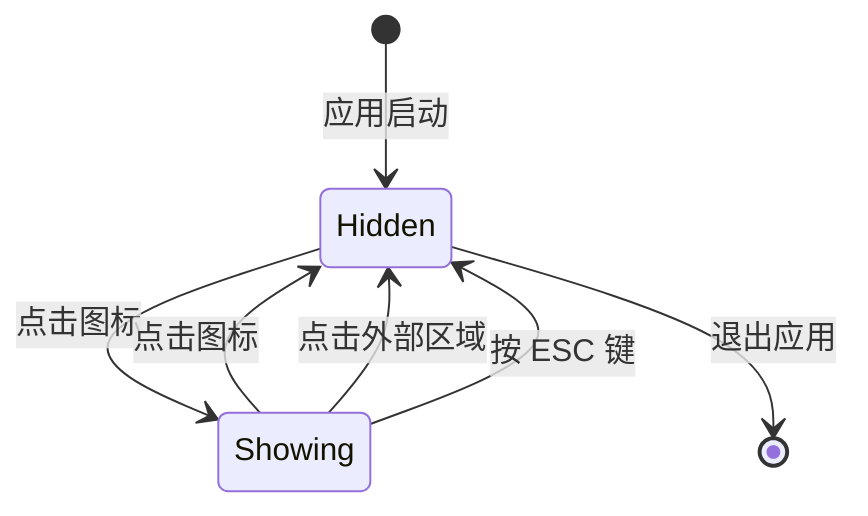
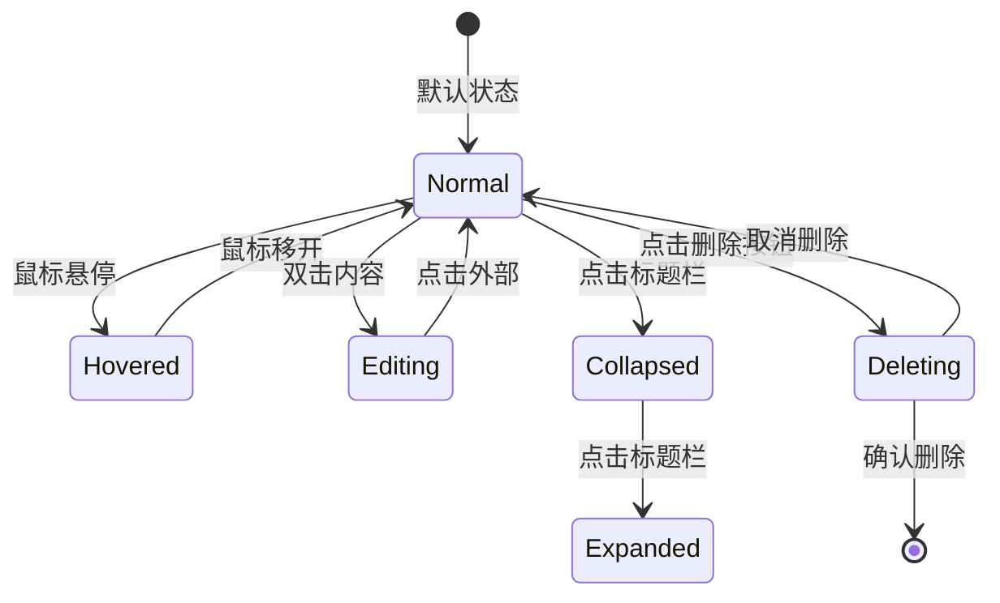
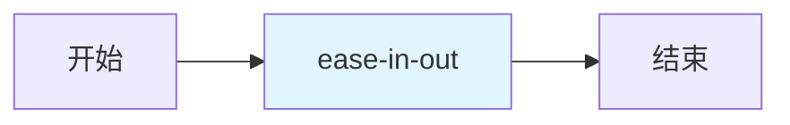

# UI/UX 设计建议 - QuickNote Clone

## 1. 界面布局方案

### 1.1 整体布局结构

```
┌─────────────────────────────────────────────────────────┐
│  📌 QuickNote Clone                          ⚙️  ✕     │ ← 菜单栏图标
└─────────────────────────────────────────────────────────┘
                        ↓ 点击图标
┌─────────────────────────────────────────────────────────┐
│  🔍 搜索便签...                            [新建便签]  │ ← 顶部工具栏
├─────────────────────────────────────────────────────────┤
│  ┌─────────────────────────────────────────────────┐   │
│  │ 📝 会议笔记                    [▼] [✕]          │   │ ← 便签卡片 1
│  │ ┌─────────────────────────────────────────────┐ │   │
│  │ │ # 项目进度                                  │ │   │
│  │ │                                             │ │   │
│  │ │ - [x] 完成需求分析                          │ │   │
│  │ │ - [ ] 开始开发                              │ │   │
│  │ │                                             │ │   │
│  │ │ **备注**: 下周一评审                        │ │   │
│  │ └─────────────────────────────────────────────┘ │   │
│  └─────────────────────────────────────────────────┘   │
│                                                         │
│  ┌─────────────────────────────────────────────────┐   │
│  │ 📝 代码片段                    [▶] [✕]          │   │ ← 便签卡片 2(折叠)
│  └─────────────────────────────────────────────────┘   │
│                                                         │
│  ┌─────────────────────────────────────────────────┐   │
│  │ 📝 购物清单                    [▼] [✕]          │   │ ← 便签卡片 3
│  │ ┌─────────────────────────────────────────────┐ │   │
│  │ │ - 牛奶                                      │ │   │
│  │ │ - 面包                                      │ │   │
│  │ │ - 鸡蛋                                      │ │   │
│  │ └─────────────────────────────────────────────┘ │   │
│  └─────────────────────────────────────────────────┘   │
│                                                         │
│  ┌─────────────────────────────────────────────────┐   │
│  │ + 新建便签                                      │   │ ← 快速操作
│  └─────────────────────────────────────────────────┘   │
└─────────────────────────────────────────────────────────┘
```

### 1.2 布局尺寸规范

| 元素 | 宽度 | 高度 | 间距 |
|-----|------|------|------|
| 主窗口 | 400px | 600px | - |
| 最小尺寸 | 300px | 400px | - |
| 最大尺寸 | 800px | 1200px | - |
| 便签卡片 | 100% | 自适应 | 12px |
| 搜索栏 | 100% | 36px | 8px |
| 操作按钮 | 100px | 32px | 8px |
| 标题栏 | 100% | 44px | - |
| 内容区域 | 100% | 自适应 | 12px |

### 1.3 响应式布局

```swift
struct ResponsiveLayout: View {
    @Environment(\.horizontalSizeClass) var horizontalSizeClass

    var body: some View {
        VStack {
            if horizontalSizeClass == .compact {
                // 紧凑布局: 单列
                compactLayout
            } else {
                // 宽松布局: 双列
                wideLayout
            }
        }
    }
}
```

---

## 2. 交互细节

### 2.1 菜单栏交互

#### 2.1.1 图标状态

| 状态 | 图标 | 说明 |
|-----|------|------|
| 默认 | 📌 | 灰色,无便签 |
| 有内容 | 📌 | 黄色,有便签 |
| 悬停 | 📌 | 放大 1.1 倍 |
| 点击 | 📌 | 缩放动画 |

#### 2.1.2 点击行为



#### 2.1.3 右键菜单

```
┌──────────────────┐
│ 📝 新建便签      │
│ ─────────────────│
│ 🔍 搜索便签      │
│ ─────────────────│
│ ⚙️ 设置          │
│ ─────────────────│
│ ❌ 退出应用      │
└──────────────────┘
```

### 2.2 便签卡片交互

#### 2.2.1 卡片状态



#### 2.2.2 悬停效果

- **边框**: 淡淡的阴影效果
- **按钮**: 显示操作按钮(折叠/删除)
- **背景**: 轻微变亮

```swift
struct NoteCard: View {
    @State private var isHovered = false

    var body: some View {
        VStack(alignment: .leading) {
            // 标题栏
            HStack {
                Image(systemName: "note.text")
                Text(note.title)
                    .font(.headline)

                Spacer()

                if isHovered {
                    Button(action: toggleCollapse) {
                        Image(systemName: note.isCollapsed ? "chevron.down" : "chevron.up")
                    }
                    .buttonStyle(.borderless)

                    Button(action: deleteNote) {
                        Image(systemName: "xmark.circle.fill")
                    }
                    .buttonStyle(.borderless)
                }
            }
            .padding(.horizontal)
            .padding(.vertical, 8)

            // 内容区域
            if !note.isCollapsed {
                Divider()
                MarkdownText(note.content)
                    .padding()
            }
        }
        .background(Color(nsColor: .controlBackgroundColor))
        .cornerRadius(8)
        .shadow(radius: isHovered ? 4 : 2)
        .overlay(
            RoundedRectangle(cornerRadius: 8)
                .stroke(Color.accentColor.opacity(0.3), lineWidth: isHovered ? 2 : 0)
        )
        .onHover { hovering in
            withAnimation(.easeInOut(duration: 0.2)) {
                isHovered = hovering
            }
        }
    }
}
```

#### 2.2.3 拖拽排序(可选)

```swift
struct NoteCard: View {
    @State private var dragOffset = CGSize.zero
    @State private var isDragging = false

    var body: some View {
        NoteCardContent(note: note)
            .offset(dragOffset)
            .opacity(isDragging ? 0.5 : 1.0)
            .gesture(
                DragGesture()
                    .onChanged { value in
                        isDragging = true
                        dragOffset = value.translation
                    }
                    .onEnded { value in
                        isDragging = false
                        // 处理排序逻辑
                        dragOffset = .zero
                    }
            )
    }
}
```

### 2.3 搜索交互

#### 2.3.1 搜索体验

- **实时搜索**: 输入即搜索,无需点击搜索按钮
- **防抖**: 延迟 300ms 后执行搜索,避免频繁请求
- **高亮**: 匹配文本高亮显示

```swift
struct SearchBar: View {
    @Binding var text: String
    @State private var isFocused = false

    var body: some View {
        HStack {
            Image(systemName: "magnifyingglass")
                .foregroundColor(.secondary)

            TextField("搜索便签...", text: $text)
                .textFieldStyle(.plain)
                .onTapGesture {
                    isFocused = true
                }

            if !text.isEmpty {
                Button(action: { text = "" }) {
                    Image(systemName: "xmark.circle.fill")
                        .foregroundColor(.secondary)
                }
                .buttonStyle(.borderless)
            }
        }
        .padding(.horizontal, 12)
        .padding(.vertical, 8)
        .background(
            RoundedRectangle(cornerRadius: 8)
                .fill(Color(nsColor: .textBackgroundColor))
                .overlay(
                    RoundedRectangle(cornerRadius: 8)
                        .stroke(
                            isFocused ? Color.accentColor : Color.clear,
                            lineWidth: 2
                        )
                )
        )
    }
}
```

#### 2.3.2 搜索结果反馈

- **无结果**: 显示空状态提示
- **加载中**: 显示加载指示器
- **搜索建议**: 显示相关关键词(可选)

```
无结果状态:
┌─────────────────────────────────────┐
│    😕                               │
│                                     │
│     未找到相关便签                  │
│                                     │
│  尝试使用其他关键词搜索             │
└─────────────────────────────────────┘
```

### 2.4 Markdown 编辑交互

#### 2.4.1 编辑器模式

| 模式 | 图标 | 快捷键 | 说明 |
|-----|------|-------|------|
| 编辑模式 | ✏️ | ⌘ + E | 显示原始 Markdown 文本 |
| 预览模式 | 👁️ | ⌘ + P | 显示渲染后的富文本 |
| 分屏模式 | 📱 | ⌘ + D | 左侧编辑,右侧预览 |

#### 2.4.2 工具栏

```
┌─────────────────────────────────────────────────────┐
│ ✏️ 👁️ 📱 | B I U | - 1. " ` | 🔗 📷 | ↩️ ↘️  │
└─────────────────────────────────────────────────────┘
```

**工具栏按钮说明**:
- **✏️ 编辑**: 切换到编辑模式
- **👁️ 预览**: 切换到预览模式
- **📱 分屏**: 分屏模式
- **B 粗体**: 插入 `**粗体**`
- **I 斜体**: 插入 `*斜体*`
- **U 下划线**: 插入 `<u>下划线</u>`
- **- 列表**: 插入 `- 列表项`
- **1. 有序列表**: 插入 `1. 列表项`
- **" 引用**: 插入 `> 引用文本`
- **` 代码**: 插入 `` `代码` ``
- **🔗 链接**: 插入 `[链接文本](url)`
- **📷 图片**: 插入 ``
- **↩️ 撤销**: 撤销操作
- **↘️ 重做**: 重做操作

#### 2.4.3 快捷键

| 快捷键 | 功能 |
|-------|------|
| ⌘ + B | 粗体 |
| ⌘ + I | 斜体 |
| ⌘ + U | 下划线 |
| ⌘ + K | 插入链接 |
| ⌘ + ⇧ + K | 插入代码块 |
| ⌘ + / | 切换编辑/预览 |
| ⌘ + Enter | 插入换行 |
| Tab | 缩进 |
| ⇧ + Tab | 取消缩进 |

### 2.5 窗口交互

#### 2.5.1 窗口控制

```
┌─────────────────────────────────────────────────────┐
│ 📌 QuickNote Clone                    [−] [□] [✕] │
└─────────────────────────────────────────────────────┘
```

**按钮说明**:
- **[-] 最小化**: 最小化到菜单栏
- **[□] 最大化**: 最大化窗口
- **[✕] 关闭**: 关闭窗口(不退出应用)

#### 2.5.2 窗口拖拽

- **拖拽区域**: 标题栏
- **拖拽反馈**: 半透明预览
- **吸附效果**: 靠近屏幕边缘时自动吸附

```swift
struct DraggableWindow: NSViewRepresentable {
    func makeNSView(context: Context) -> NSView {
        let view = NSView()
        view.window?.isMovableByWindowBackground = true
        return view
    }

    func updateNSView(_ nsView: NSView, context: Context) {}
}
```

#### 2.5.3 窗口调整大小

- **调整区域**: 右下角
- **最小尺寸**: 300×400
- **最大尺寸**: 800×1200
- **调整反馈**: 显示当前尺寸

### 2.6 动画效果

#### 2.6.1 动画时长

| 动画类型 | 时长 | 缓动函数 |
|---------|------|---------|
| 展开/折叠 | 200ms | ease-in-out |
| 淡入/淡出 | 150ms | ease-in-out |
| 悬停效果 | 100ms | ease-out |
| 页面切换 | 300ms | ease-in-out |
| 加载动画 | 持续 | linear |

#### 2.6.2 动画实现

```swift
// 展开/折叠动画
withAnimation(.easeInOut(duration: 0.2)) {
    note.isCollapsed.toggle()
}

// 淡入/淡出动画
Transition.opacity.combined(with: .scale(scale: 0.95))

// 悬停效果
.animation(.easeOut(duration: 0.1), value: isHovered)
```

#### 2.6.3 动画曲线



**推荐缓动函数**:
- `easeInOut`: 适用于展开/折叠
- `easeOut`: 适用于悬停效果
- `spring`: 适用于弹性效果

---

## 3. 视觉风格参考

### 3.1 配色方案

#### 3.1.1 主题色

| 用途 | 浅色模式 | 深色模式 | 十六进制 |
|-----|---------|---------|---------|
| 主色调 | #FFD700 | #FFD700 | 金黄色 |
| 强调色 | #007AFF | #0A84FF | 苹果蓝 |
| 成功色 | #34C759 | #30D158 | 绿色 |
| 警告色 | #FF9500 | #FF9F0A | 橙色 |
| 错误色 | #FF3B30 | #FF453A | 红色 |

#### 3.1.2 便签颜色

| 颜色 | 名称 | 浅色模式 | 深色模式 |
|-----|------|---------|---------|
| 🟡 | 经典黄 | #FFF9C4 | #4A412A |
| 🔵 | 天空蓝 | #E3F2FD | #1A2B3C |
| 🟢 | 薄荷绿 | #E8F5E9 | #1E3A2F |
| 🟣 | 梦幻紫 | #F3E5F5 | #3E2A4D |
| 🩷 | 樱花粉 | #FCE4EC | #4D2A3A |

#### 3.1.3 文字颜色

| 用途 | 浅色模式 | 深色模式 |
|-----|---------|---------|
| 主标题 | #000000 | #FFFFFF |
| 副标题 | #333333 | #E0E0E0 |
| 正文 | #666666 | #B0B0B0 |
| 辅助文字 | #999999 | #808080 |
| 禁用文字 | #CCCCCC | #505050 |

#### 3.1.4 背景颜色

| 用途 | 浅色模式 | 深色模式 |
|-----|---------|---------|
| 主背景 | #FFFFFF | #1C1C1E |
| 次背景 | #F5F5F7 | #2C2C2E |
| 卡片背景 | #FFFFFF | #3A3A3C |
| 分隔线 | #E5E5E5 | #38383A |

### 3.2 字体规范

#### 3.2.1 字体家族

| 用途 | 字体 | 字重 |
|-----|------|------|
| 标题 | SF Pro Display | Bold (700) |
| 副标题 | SF Pro Text | Semibold (600) |
| 正文 | SF Pro Text | Regular (400) |
| 代码 | SF Mono | Regular (400) |
| 辅助文字 | SF Pro Text | Light (300) |

#### 3.2.2 字号规范

| 用途 | 字号 | 行高 |
|-----|------|------|
| 大标题 | 24px | 32px |
| 中标题 | 20px | 28px |
| 小标题 | 16px | 24px |
| 正文 | 14px | 22px |
| 辅助文字 | 12px | 18px |
| 代码 | 13px | 20px |

#### 3.2.3 字体实现

```swift
extension Font {
    static let appTitle = Font.system(size: 24, weight: .bold)
    static let appSubtitle = Font.system(size: 20, weight: .semibold)
    static let appBody = Font.system(size: 14, weight: .regular)
    static let appCaption = Font.system(size: 12, weight: .light)
    static let appCode = Font.system(size: 13, design: .monospaced)
}
```

### 3.3 圆角规范

| 元素 | 圆角半径 |
|-----|---------|
| 窗口 | 12px |
| 卡片 | 8px |
| 按钮 | 6px |
| 输入框 | 8px |
| 标签 | 4px |

### 3.4 阴影规范

| 元素 | 阴影半径 | 阴影偏移 | 阴影透明度 |
|-----|---------|---------|-----------|
| 窗口 | 20px | (0, 8) | 0.15 |
| 卡片(默认) | 2px | (0, 1) | 0.1 |
| 卡片(悬停) | 4px | (0, 2) | 0.15 |
| 按钮 | 2px | (0, 1) | 0.1 |

```swift
extension View {
    func cardShadow() -> some View {
        self.shadow(
            color: Color.black.opacity(0.1),
            radius: 2,
            x: 0,
            y: 1
        )
    }

    func cardShadowHovered() -> some View {
        self.shadow(
            color: Color.black.opacity(0.15),
            radius: 4,
            x: 0,
            y: 2
        )
    }
}
```

### 3.5 间距规范

#### 3.5.1 基础间距

| 名称 | 值 | 用途 |
|-----|---|------|
| xs | 4px | 小元素间距 |
| sm | 8px | 按钮内边距 |
| md | 12px | 卡片间距 |
| lg | 16px | 区块间距 |
| xl | 24px | 大区块间距 |
| xxl | 32px | 页面边距 |

#### 3.5.2 间距实现

```swift
struct Spacing {
    static let xs: CGFloat = 4
    static let sm: CGFloat = 8
    static let md: CGFloat = 12
    static let lg: CGFloat = 16
    static let xl: CGFloat = 24
    static let xxl: CGFloat = 32
}

// 使用示例
VStack(spacing: Spacing.md) {
    // 内容
}
.padding(Spacing.lg)
```

### 3.6 图标规范

#### 3.6.1 图标来源

- **SF Symbols**: Apple 官方图标库(推荐)
- **自定义图标**: 必须符合 Apple 设计规范

#### 3.6.2 图标尺寸

| 用途 | 尺寸 |
|-----|------|
| 菜单栏图标 | 16×16pt |
| 工具栏图标 | 20×20pt |
| 按钮图标 | 16×16pt |
| 列表图标 | 24×24pt |

#### 3.6.3 常用图标

| 功能 | SF Symbol |
|-----|-----------|
| 便签 | `note.text` |
| 搜索 | `magnifyingglass` |
| 新建 | `plus` |
| 删除 | `trash` 或 `xmark.circle.fill` |
| 编辑 | `pencil` |
| 预览 | `doc.text` |
| 折叠 | `chevron.up` |
| 展开 | `chevron.down` |
| 设置 | `gearshape` |
| 退出 | `power` |

```swift
Image(systemName: "note.text")
    .font(.system(size: 20))
    .foregroundColor(.accentColor)
```

---

## 4. 组件设计

### 4.1 按钮组件

#### 4.1.1 主要按钮

```swift
struct PrimaryButton: View {
    let title: String
    let action: () -> Void

    var body: some View {
        Button(action: action) {
            Text(title)
                .font(.system(size: 14, weight: .semibold))
                .foregroundColor(.white)
                .padding(.horizontal, 16)
                .padding(.vertical, 8)
                .background(Color.accentColor)
                .cornerRadius(6)
        }
        .buttonStyle(.plain)
        .cardShadow()
    }
}
```

#### 4.1.2 次要按钮

```swift
struct SecondaryButton: View {
    let title: String
    let action: () -> Void

    var body: some View {
        Button(action: action) {
            Text(title)
                .font(.system(size: 14, weight: .medium))
                .foregroundColor(.accentColor)
                .padding(.horizontal, 16)
                .padding(.vertical, 8)
                .background(Color.accentColor.opacity(0.1))
                .cornerRadius(6)
        }
        .buttonStyle(.plain)
    }
}
```

#### 4.1.3 图标按钮

```swift
struct IconButton: View {
    let icon: String
    let action: () -> Void

    var body: some View {
        Button(action: action) {
            Image(systemName: icon)
                .font(.system(size: 16))
                .foregroundColor(.secondary)
                .frame(width: 32, height: 32)
                .background(Color(nsColor: .controlBackgroundColor))
                .cornerRadius(6)
        }
        .buttonStyle(.plain)
        .onHover { hovering in
            withAnimation {
                // 悬停效果
            }
        }
    }
}
```

### 4.2 输入框组件

```swift
struct AppTextField: View {
    let placeholder: String
    @Binding var text: String

    var body: some View {
        TextField(placeholder, text: $text)
            .textFieldStyle(.plain)
            .font(.system(size: 14))
            .padding(.horizontal, 12)
            .padding(.vertical, 8)
            .background(
                RoundedRectangle(cornerRadius: 8)
                    .fill(Color(nsColor: .textBackgroundColor))
            )
            .overlay(
                RoundedRectangle(cornerRadius: 8)
                    .stroke(Color.secondary.opacity(0.3), lineWidth: 1)
            )
    }
}
```

### 4.3 标签组件

```swift
struct NoteTag: View {
    let text: String
    let color: Color

    var body: some View {
        Text(text)
            .font(.system(size: 11, weight: .medium))
            .foregroundColor(color)
            .padding(.horizontal, 8)
            .padding(.vertical, 4)
            .background(color.opacity(0.1))
            .cornerRadius(4)
    }
}
```

### 4.4 空状态组件

```swift
struct EmptyState: View {
    let icon: String
    let title: String
    let subtitle: String
    let actionTitle: String?
    let action: (() -> Void)?

    var body: some View {
        VStack(spacing: 16) {
            Image(systemName: icon)
                .font(.system(size: 64))
                .foregroundColor(.secondary)

            Text(title)
                .font(.title2)
                .fontWeight(.semibold)

            Text(subtitle)
                .font(.body)
                .foregroundColor(.secondary)
                .multilineTextAlignment(.center)

            if let actionTitle = actionTitle, let action = action {
                Button(action: action) {
                    Text(actionTitle)
                }
                .buttonStyle(.borderedProminent)
            }
        }
        .frame(maxWidth: .infinity, maxHeight: .infinity)
        .padding()
    }
}
```

---

## 5. 深色模式适配

### 5.1 颜色适配

```swift
extension Color {
    static let appBackground = Color(nsColor: .windowBackgroundColor)
    static let appCardBackground = Color(nsColor: .controlBackgroundColor)
    static let appText = Color(nsColor: .labelColor)
    static let appSecondaryText = Color(nsColor: .secondaryLabelColor)
}
```

### 5.2 动态适配

```swift
struct ContentView: View {
    @Environment(\.colorScheme) var colorScheme

    var body: some View {
        VStack {
            Text("Hello, World!")
                .foregroundColor(colorScheme == .dark ? .white : .black)
        }
        .background(colorScheme == .dark ? Color.black : Color.white)
    }
}
```

### 5.3 深色模式切换

```swift
struct DarkModeToggle: View {
    @AppStorage("isDarkMode") private var isDarkMode = false

    var body: some View {
        Toggle("深色模式", isOn: $isDarkMode)
            .preferredColorScheme(isDarkMode ? .dark : .light)
    }
}
```

---

## 6. 无障碍设计

### 6.1 VoiceOver 支持

```swift
struct AccessibleButton: View {
    let title: String
    let action: () -> Void

    var body: some View {
        Button(action: action) {
            Text(title)
        }
        .accessibilityLabel(title)
        .accessibilityHint("点击执行操作")
    }
}
```

### 6.2 键盘导航

```swift
struct KeyboardNavigationView: View {
    var body: some View {
        List {
            ForEach(notes) { note in
                NoteCard(note: note)
                    .focusable()
            }
        }
        .focusSection()
    }
}
```

### 6.3 对比度要求

- **文字对比度**: ≥ 4.5:1(WCAG AA 标准)
- **大文字对比度**: ≥ 3:1
- **图形对比度**: ≥ 3:1

---

## 7. 设计资源

### 7.1 设计工具

- **Figma**: UI 设计和原型
- **Sketch**: 界面设计
- **SF Symbols**: 图标库
- **ColorSnapper**: 取色工具

### 7.2 设计交付物

- [ ] UI 设计稿(Figma/Sketch)
- [ ] 交互原型
- [ ] 设计规范文档
- [ ] 切图资源
- [ ] 动效说明

### 7.3 设计评审检查单

- [ ] 符合 macOS Human Interface Guidelines
- [ ] 支持深色模式
- [ ] 符合无障碍标准
- [ ] 动画流畅自然
- [ ] 交互逻辑清晰
- [ ] 视觉层次分明
- [ ] 颜色对比度达标
- [ ] 字体大小合理

---

## 8. 参考案例

### 8.1 QuickNote 原版

- **优点**: 简洁、快速、置顶
- **可借鉴**: 菜单栏集成、快速启动

### 8.2 Bear

- **优点**: Markdown 支持、美观
- **可借鉴**: 编辑器设计、语法高亮

### 8.3 Notion

- **优点**: 功能强大、灵活
- **可借鉴**: 块级编辑、拖拽排序

### 8.4 Apple Notes

- **优点**: 系统集成、流畅
- **可借鉴**: 手势操作、快速笔记

---

**文档版本**: v1.0
**创建日期**: 2026-01-05
**最后更新**: 2026-01-05
**文档状态**: 待评审